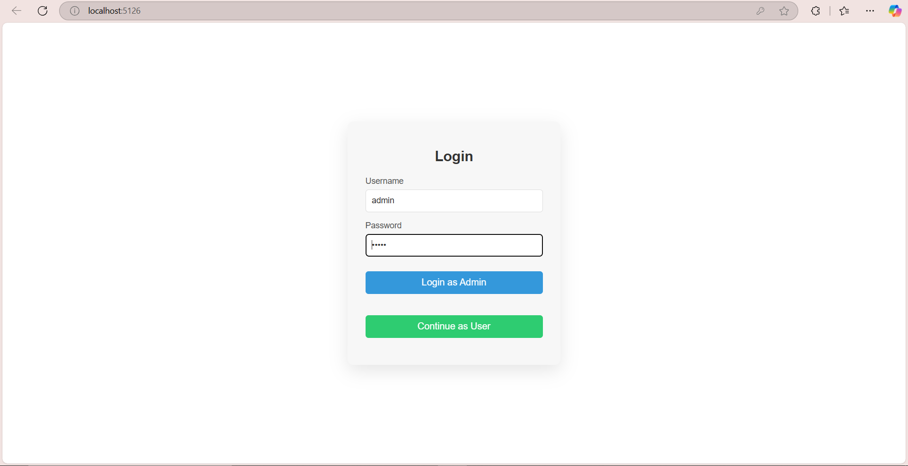
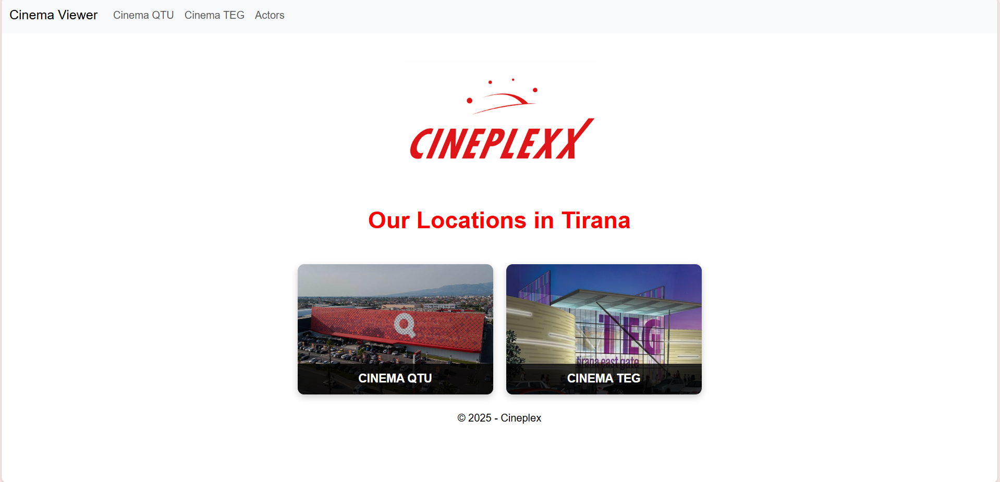
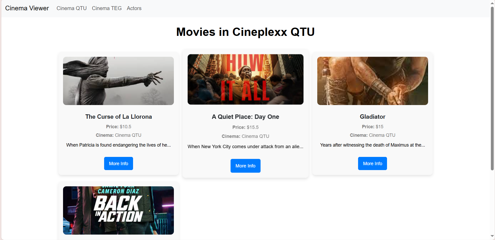
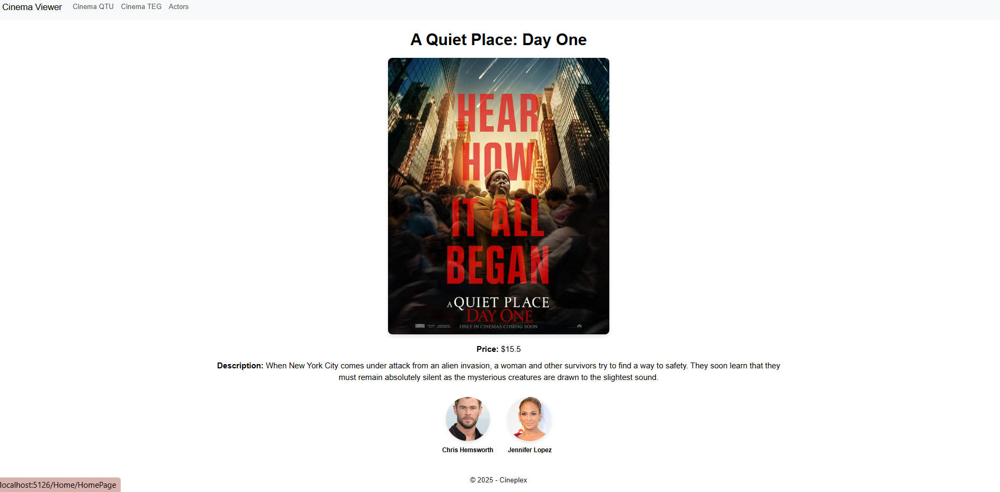
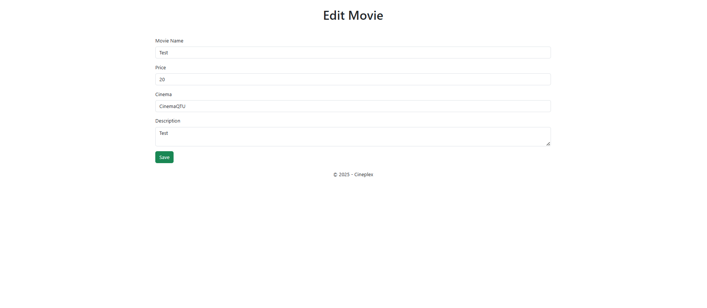
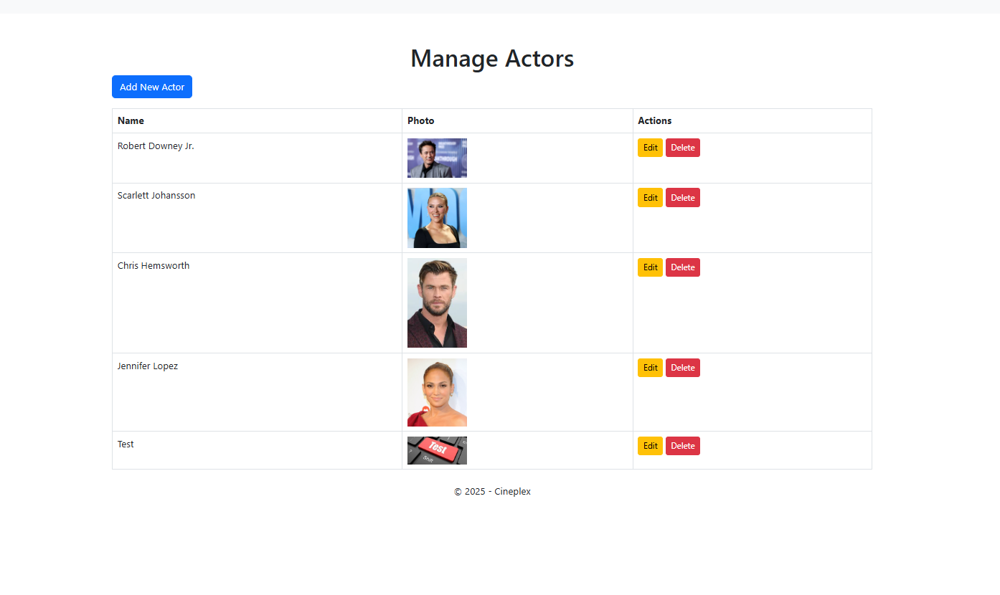

# Cineplex ASP.NET Core MVC Project

## Overview
Cineplex is an ASP.NET Core MVC web application for managing and displaying movies in different cinemas. It features authentication for users and admins, movie and actor management, and dynamic content updates.

## Features

### User Features
- **Home Page**: Browse available movies.
- **Cinema QTU & TEG**: View movies listed in each cinema.
- **Movie Details**: Click on a movie to view its description and details.
- **Actors List**: See actors starring in the movies.

### Admin Features
- **Admin Login**: Access management features.
- **Movie & Actor CRUD Operations**:
  - Add, edit, and delete movies.
  - Add, edit, and delete actors.
- **Manage Page**: Overview and management of all movies and actors.
- **Session-Based Visibility**: Changes made in the admin panel are reflected immediately for users in the current session.

## Installation

1. Clone the repository:
   ```sh
   git clone <repository-url>
   ```
2. Navigate to the project directory:
   ```sh
   cd Cineplex
   ```
3. Restore dependencies:
   ```sh
   dotnet restore
   ```
4. Run the project:
   ```sh
   dotnet run
   ```
5. Open the application in a web browser at `http://localhost:5000` (or the displayed URL).

## Screenshots

### Login Page


### Home Page


### Cinema QTU


### Movie Details


### Admin Create and Edit Page


### Admin Manage Page


## Technologies Used
- C# .NET Core MVC
- Entity Framework Core
- SQL Server (or other configured database)
- Bootstrap & CSS for UI styling

## License
This project is open-source. Feel free to modify and use it for learning purposes.

